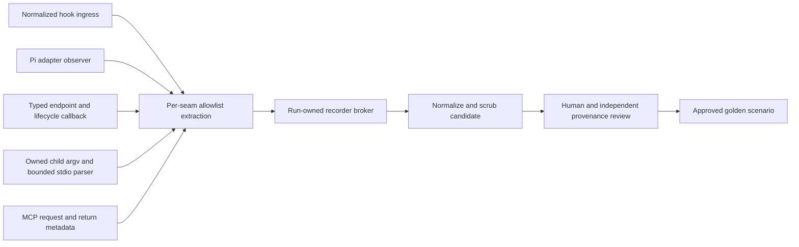

# W5 recorder and clock design — Stage A checkpoint

## Status and boundaries

Stage A contains dependency-free native-Node TS format/scrub tooling and three
**untimed executable prototypes**. It does not contain a recorder, shared clock,
production seam edits, runner tests or golden recordings. Stage B is blocked on
accepted W2 integration and explicit coordinator release. W3 adopts the local
scenario DTO into its canonical TypeBox/JSON Schema contracts; these local types
and allowlists are not a second shared contracts layer.

The only sample, `examples/synthetic-processes.json`, is hand-authored, named
`synthetic-herdr-worker-lifecycle`, and pins both versions to `synthetic`. It is a
CLI/stdio illustration, not evidence of the four real delivery journeys. Version
strings and the presence of lifecycle-shaped events do not establish provenance.

Available-source census at base b0ab579: `find test/fixtures -type f` finds three
Markdown block examples and `mermaid-silent-worker.mjs`, not harness recordings.
Existing fake scripts are not recordings. No normalized recording artifact with
pinned source versions and review evidence is available in the permitted checkout.
No private journals, transcripts, credentials or native harness runs were accessed.
The exact golden gate is an authorized run artifact plus source version/provenance
review; it cannot be cleared by changing synthetic names/version metadata.

## Scenario normalization and scrub

Exact outer shape:

```json
{"schema":1,"scenario":"synthetic-herdr-worker-lifecycle","source":{"harness":"herdr","harness_version":"synthetic","golem_version":"synthetic"},"seed":7,"events":[{"seq":1,"at_ms":0,"boundary":"process","direction":"in","operation":"process-spawn","fields":{"harness":"herdr","argv":["--version"]}}]}
```

This abbreviated shape illustrates an event, not a complete replay transaction.
Real scenario identities are closed to typed brief accepted/settled, Claude
acknowledged/returned, herdr worker lifecycle, and dashboard restart/stranded
envelope. Synthetic variants have a `synthetic-` prefix and synthetic versions;
non-synthetic candidates require numeric pinned versions but remain **unapproved**.
Sequence starts at 1 and is contiguous; relative milliseconds are nonnegative and
monotonic. `in` means input to that boundary owner; `out` means its consequence.
Operations constrain boundary and direction; unknown/malformed variants fail.

`tools/scenario-format.ts` owns the provisional DTO/enums. The scrub module is a
pure transform; CLI I/O is separate. JSON input is bounded to 1 MiB, a regular
non-symlink file, with no directory discovery. At most 10,000 events, 64 fields per
record, 256 list items, depth 8 and 100,000 structural nodes/fields are accepted.
Errors name structural failure categories, never the rejected value/private path.

Retention allowlist:

| Category | Handling |
|---|---|
| IDs, canonical/session/envelope/attempt/project/team/worker/workspace/tab/pane | Stable typed `$type:N` symbols, never real IDs |
| Paths/cwd, PID, port, model | Typed symbols; raw paths must be absolute; PID/port bounded |
| State/outcome/status, booleans, exit/status/duration/schema numbers | Closed enums/types/ranges; no free text |
| Hook event, MCP method/tool name, transport, kind, stdout recipe/version | Closed source-grounded structural enums |
| Minimal result/response/workspace/pane/agent/session/item containers | Recursively the same closed allowlist; not full raw tool output |
| Content, prompts, assistant/tool input/output, transcript, ticket/file body, stdin/stdout/stderr, label/name/error text | Semantic `<redacted:field>` placeholders, never hashes |
| Tokens, API/access keys, credentials, password, env dumps, username | Omitted completely |
| Any unknown field or uncertain mixed raw/symbol identity class | Reject the candidate; no heuristic passthrough |

Argv preserves only known public command/flag literals. Dynamic values after
known identity/path/model flags and ID-valued herdr selectors become symbols;
label/provider/free-text arguments become semantic wildcards. Unknown leading
commands/flags fail. Simulators compare literals/count, bind symbols consistently
and do not retain wildcard contents. This provisional argv vocabulary is a
**subset**, not full native CLI coverage; Stage B extends it only from seam/source
contracts and accepted recordings. Version metadata is not arbitrary text.

Replay accepts only already-scrubbed canonical data. Normalization cannot silently
turn an unsafe replay into an approved fixture. The symbol table stays in memory;
there is no private-content hash or raw-identity mapping written into a candidate.
Stage A's content markers do not preserve private payload equality/distinction.
A reviewer must reject a payload-sensitive replay claim that depends on those
lost bytes; Stage B must define adequate semantic placeholders/projections before
approving such a golden. Canonical shape/scrub alone is not behavior equivalence.

## Recorder seam ownership — Stage B, not implemented



| Owner/source at b0ab579 | Capture point and exclusions |
|---|---|
| `substrate/hooks/journal-route.sh` | New normalized ingress projection before its raw journal payload write. Do not replay/open `hook.jsonl`; do not route its whole payload into the recorder. Shell hands only selected metadata to the broker. |
| `lib/pi-native-adapter.js` `observe()` (834), lifecycle observers | Selected native observer/lifecycle kind, state and symbolic identities. No prompt/assistant/tool content, model config/auth or transcript paths read for recording. |
| `lib/typed-worker-endpoint.js` `startTypedWorkerEndpoint()` (430), claim/accept/settle/report helpers | Capture validated request metadata and accepted/settled consequences at their actual owners. Drop endpoint secrets and private-content delivery digests; do not substitute recorder events for real transitions. |
| `lib/herdr-driver.js` `runHerdr()` / child spawn; `lib/worker-manager.js` `spawnWorker()` | One source-owned child observation wrapper for argv, bounded structural stdio extraction, exit/signal and ownership. Never pipe whole stdout/stderr/env into the candidate. |
| `mcp/channel/index.js` request handlers and return path | Tools/method/kind and approved structural request/return projections, not raw tool input/output. Shared child wrapper can observe framing; semantic extraction stays at the MCP owner. |
| `dashboard/server/dispatch-queue.js` `initDispatchDrainer()` (51), schedule runtime/service, tracker outbox | Record real attempted/accepted/reconciled delivery and restart consequences. Do not fabricate state/settlement based on fixture text. |

`GOLEM_RECORD_SCENARIO` is either absent (off) or an explicit absolute candidate
file under an existing owned 0700 temporary directory. No default path, HOME
fallback, shared workspace output, overwrite or raw journal spool is allowed.
The broker exclusively creates a 0600 candidate, owns ordering/normalization and
receives only allowlisted projections. Unsafe projection, overflow, participant
loss or uncertain scrub aborts approval of the entire candidate, not a silently
partial recording. Errors are bounded structural codes. Review rejects candidate
provenance not tied to an authorized source run; no native run is authorized now.

Cross-process writes go through one broker, not append races to one JSON file.
W3 must coordinate journal/spool version headers before those source files change.
A recorder is opt-in observation only: a failed recorder must not claim successful
recording or mutate delivery state. Whether production recording failure aborts
its *run* versus only its candidate is a Stage B behavior choice, not implemented.

## Shared clock control socket — design only

One source `lib/clock.ts` exposes `now`, timeout/interval schedule and cancellation.
The default implementation delegates to native time/timers. An injected test clock
is run-owned, monotonic, deterministic and shared by the endpoint, adapter,
dashboard and all simulators. No monkey-patching global Date/timers or separate
per-process clocks may make a timeout pass.

Broker control messages are provisional until W3 adopts canonical schemas:
`hello` (participant/run/capability), `schedule` (timer symbol, deadline, interval),
`cancel`, `advance` (target relative time), `fire`, `ack` and `barrier`.
The capability is ephemeral runtime-only data and is never recorded. Frames are
bounded JSON (16 KiB proposed); the Unix socket lives in the run's private temp
root with 0600 permissions and a checked portable path length. No production
ports, inherited native sockets or process-global shared names are used.

An advance fires timers in `(deadline, registration-sequence)` order, waits for
all participating owners to acknowledge effects, then commits the barrier. A
restart re-handshakes against the same run clock without resetting epoch or
silently losing timers. Missing peers/deadlines fail boundedly; repeating timers
cannot spin unboundedly. IO shutdown deadlines remain real-time safety limits,
not the scenario's delivery time. The under-one-wall-second acceptance requires
an actual injected timeout/restart journey, not an untimed sequence of outputs.

Injection sites include endpoint expiry and lifecycle-report deadlines; Pi
heartbeat/accept/control/reload-grace timers; dashboard drainer scheduling,
schedule-service/outbox deadlines and their current `Date.now` consumers.
`dispatch-queue.js` already accepts `nowMs` but still has a native interval (682);
that seam alone is insufficient. Do not replace production timing in Stage A.

Lifecycle ownership: runner creates temp root/broker and binds exact child
processes; children connect, register timer/recorder resources and release on
close; runner cancels timers, closes/drains sockets, stops/reaps owned children,
then removes only its own root. SIGKILL/broken pipe/participant loss requires
parent-owned cleanup, not a child `finally` assumption. Unknown ownership fails
closed, never sweeping live groups. Failure tests must exercise open inherited
pipes, cancellation, concurrent requests, stale locks and partial setup.

## Executable prototypes and limits

Set explicit `GOLEM_SIM_SCENARIO` and existing owned temporary
`GOLEM_SIM_STATE_DIR`. `test/sim/claude`, `pi`, and `herdr` load shared TS support;
they do not spawn binaries, open sockets, fetch models/network or inspect user
state. Each executable consumes its own ordered process transactions immediately;
other hook/MCP/typed/herdr events are validated metadata, not delivery replay.

Cursor state is private 0600 data under the explicit temp directory. An exclusive
lock guards cooperating consumers; unknown/stale locks, symlinks, cursor/scenario
mismatch, malformed transaction/argv, changed/collapsed symbols and exhaustion
fail with exit 2. No stale-lease recovery or native fallback occurs. Runtime
bindings may contain the test caller's temporary IDs/paths, never committed
recording data. Unbound PID output is refused until Stage B supplies an owned
actor; generated path/port values are non-binding symbolic consequences, not
actual listeners/files. Same-harness overlap and multiple stdin records are not
supported by the Stage A transaction model.

Stdin is limited to 64 KiB and a two-second safety deadline; stdout/stderr write
backpressure has the same deadline. Dedicated CLI exit happens only after owned
lock/candidate cleanup, so a blocked pipe cannot keep the prototype alive.
External TERM/INT/HUP cancels pending IO and is re-raised after cleanup; recorded
signals are also re-raised after cleanup. SIGKILL still needs parent cleanup.
Cursor advances before emission; IO failure after that point is an uncertain
consumed transaction, not safe automatic replay. This is disclosed prototype
behavior, not an exactly-once delivery guarantee.

## Stage B gates and first journeys

| Journey | Required observed events and check |
|---|---|
| Typed brief accepted/settled | Actual endpoint validates input and actual Pi owner accepts/settles; mutation removes/breaks that transition and fails assertions. |
| Claude dispatch ack/return | Actual normalized hook/MCP events select correct correlated ack and durable return; simulation alone is not native consumption. |
| Herdr create/roster/stop | Exact mapped resources and owned lifecycle consequences, including teardown failure; no fixture-seeded state posing as creation. |
| Dashboard restart stranded envelope | Actual queue/drainer restart reconciles the stranded lineage under the same injected clock; no real sleeps masquerading as deterministic timeout. |

Before integration: accept W2, explicitly release Stage B, bring W2 into this
branch, adopt strict/native/Vitest gates and add failure tests, agree W3 canonical
contract/header ownership, obtain authorized genuine candidates, scrub/review
provenance, wire real seams/shared clock, mutation-check each journey once, run
Linux integration and prove timeout under one wall-second. Fresh review and
independent acceptance follow before a serialized spec merge. Stage A satisfies
none of those gates merely by having executable prototypes or a synthetic sample.
