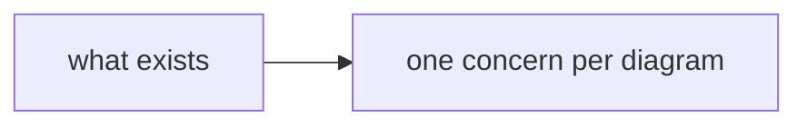

# Doc: <short title — what this page answers or explores>

<!-- Form: Global Rules § How to talk to me; diagram rules as in templates/spec.md; mermaid rules
in golem:tracker § Writing. Two shapes, keep the sections the job needs:
  research → Question · Summary · Findings · Implications · Method
  scratchpad → Question · Summary · one section per exploration thread -->

## Question

<!-- The commission in 1–2 lines: what this doc answers or explores, and for which spec or
decision. -->

## Summary

<!-- The standing answer, at most 7 bullets, kept current. Scratchpad shape: the insights and
which D# each thread feeds. -->

- <bullet>

## Findings

<!-- Research shape: facts with evidence, diagram-first; file:line refs in the Evidence table. -->

*Caption: <what this diagram shows>.*

- 📌 <fact a diagram cannot carry>

### Evidence

fact → source refs

| 📌 Fact | Refs |
|---|---|
| <fact> | `path/file.ext:12-34` |

## <exploration thread>

<!-- Scratchpad shape: one section per thread; decisions live only in the parent spec. When a
thread has served its purpose, note the D# it fed and wrap it in 
. -->

- 📌 <insight>
- ▶ feeds: <D# in the parent spec>

## Implications

<!-- Optional: what the findings mean for the spec or decision, plus your recommendation. -->

## Method

<!-- Optional: commands run, sources consulted, scope covered. Keep when credibility or
reproducibility matters. -->
