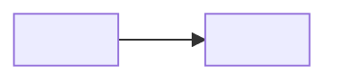

# Spec: <subject>

<!-- Form: Global Rules § How to talk to me. Diagrams over prose, tables over lists. One concern
per diagram, tall over wide, a caption under each: flowchart · sequenceDiagram · classDiagram ·
erDiagram · stateDiagram-v2 · journey · timeline. One meaning per hue, legible on light and dark.
Mermaid rules: golem:tracker § Writing. Keep this comment. -->

## 1. TLDR

<!-- At most 7 short bullets with anchors, then one status line. -->

- <bullet>

**Status:** <where this spec stands, what awaits whom>

## 2. Intent

<!-- Short prose: the why. Raw thoughts verbatim in the collapsed block, never rewritten. -->

Raw thoughts (preserved verbatim)

<original notes>

## 3. Grounding

<!-- Current reality, diagram-first, 1–6 diagrams. 📌 bullets for what a diagram cannot carry.
File:line refs go in the Evidence table. -->

*Caption: <what this diagram shows>.*

- 📌 <fact a diagram cannot carry>

### Evidence

fact → source refs

| 📌 Fact | Refs |
|---|---|
| <fact> | `path/file.ext:12-34` |

## 4. Requirements

<!-- Three tables, no prose between. -->

### 🎯 Goals & Functional Requirements

| # | Requirement | Value |
|---|---|---|
| G1 | <checkable requirement> | <why it matters> |

### Qualities & Non-functional Requirements

| Quality | Constraint | Measure |
|---|---|---|
| <quality> | <the limit it imposes> | <how it is judged> |

### 🚫 Non-goals

| Non-goal | Why excluded |
|---|---|
| <exclusion> | <reason> |

## 5. Decisions

<!-- One row per decision; one block per decision below. ❓ open: Context · Options · Recommendation
(my comment surface). 🔒 decided: collapsed Call · Why · Rejected · Consequences · Trail. -->

| D# | Decision | Status | Call |
|---|---|---|---|
| D1 | <title> | 🔒 | <one-line call> |
| D2 | <title> | ❓ | see below |

🔒 D1 — <title> — <one-line call>

- Call: <what was decided>
- Why: <the reason>
- Rejected: <alternative — one-line reason> · <alternative — one-line reason>
- Consequences: <optional>
- Trail: <scratchpad doc id — optional>

### ❓ D2 — <title>

- Context: <what forces this decision>

| Option | Entails | Trade-off |
|---|---|---|
| <a> | <what choosing it means> | <consequence, cost, risk> |

- Recommendation: <yours, with the reason>

## 6. Design

<!-- 3–7 subsections by relevance: Architecture · Components · Data model · Schema · Interfaces ·
Control flow · Data flow · Lifecycles · UX journey. Diagram plus bullets keyed to D#. -->

### Architecture

- <technical bullet, keyed to D#>

## 7. Acceptance Criteria

<!-- Every scenario agent-runnable: do X, observe Z. Mark inferred probes as inferred.
Status: ⬜ todo · ✅ pass · ❌ fail -->

| # | Scenario | Verify by | Status |
|---|---|---|---|
| A1 | <do X, observe Z> | <command, page, probe> | ⬜ |
