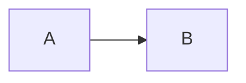

# Fixture: rich Markdown

Intro paragraph with **bold** and `code`.

## Lists

- alpha item
- beta item
  - nested item

1. first ordered
2. second ordered

## Table

| name | value |
| ---- | ----- |
| one  | 1     |
| two  | 2     |

## Code

```js
const x = 1;
```



> A blockquote worth keeping.

---

<details>
<summary>Evidence</summary>

Inner paragraph.

- inner list item

</details>

Tail paragraph.
